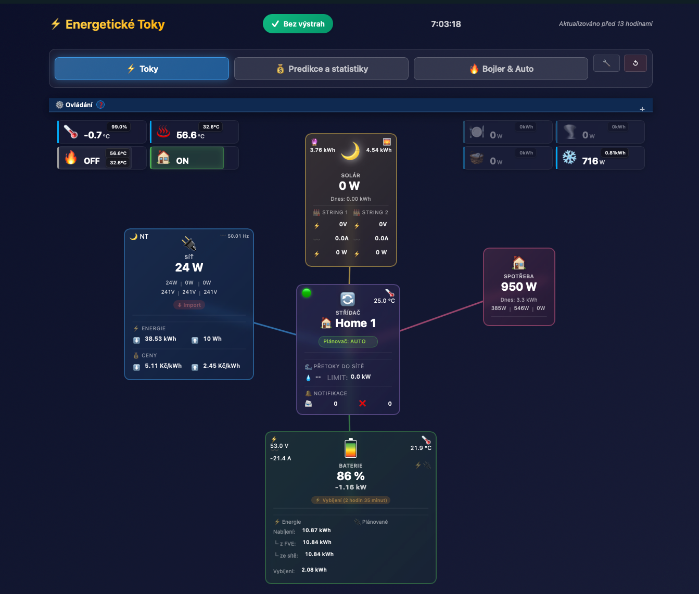
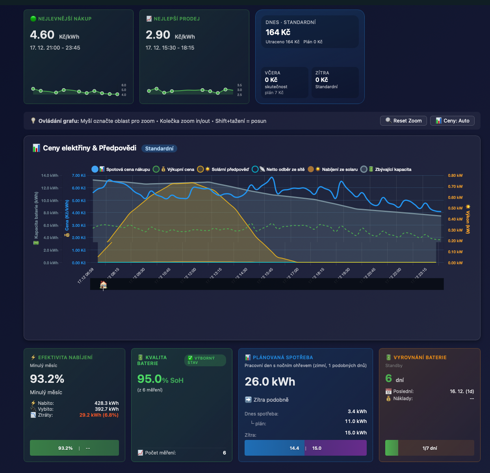

# ČEZ Battery Box - OIG Cloud Integrace pro Home Assistant

[](https://github.com/hacs/integration)


[](https://github.com/psimsa/oig_cloud/actions/workflows/hassfest.yml)
[](https://github.com/psimsa/oig_cloud/actions/workflows/hacs.yml)
[](https://www.codefactor.io/repository/github/psimsa/oig_cloud)

Kompletní Home Assistant integrace pro ČEZ Battery Box přes OIG Cloud API. Monitorování, řízení a automatizace vašeho domácího úložiště energie.

Integrace umí čerpat telemetrii buď přímo z OIG Cloud, nebo z lokálního zdroje (OIG Proxy) pro rychlejší aktualizace a odolnější chod při krátkých výpadcích cloudu.

---

## 🚀 Hlavní Funkce

### 🗂️ **Zdroje dat (Cloud / Local)**
- **Cloud**: oficiální OIG Cloud API (standardní režim)
- **Local (OIG Proxy)**: lokální zdroj telemetrie pro rychlejší refresh a fallback (typicky v LAN)

📖 Podrobnosti: [Zdroj telemetrie](./docs/user/DATA_SOURCE.md)  
🔗 OIG Proxy repo: https://github.com/Muriel2Horak/oig-proxy

### 📊 **Monitorování v reálném čase**
- Aktuální výkon a stav baterie (SOC, napětí, teplota)
- FVE výroba a domácí spotřeba
- Import/export elektrické sítě
- Sledování bojleru a dalších zařízení

### ⚡ **Integrace s Home Assistant Energy**
- Přímá podpora pro Energy Dashboard
- Statistiky výroby, spotřeby a toků energie
- Dlouhodobé ukládání dat

### 🎛️ **Pokročilé Řízení**
- Změna pracovního režimu (Home, Home+, Grid, UPS)
- Nastavení přetoků do sítě
- Řízení bojleru
- Podpora více Battery Boxů na jednom účtu

### 🛡️ **ServiceShield™ Ochrana**
- Automatická ochrana proti nechtěným změnám
- Configurable timeout protection (5-60 minut)
- Detekce externích změn režimu
- Live monitoring změn

### 🧙‍♂️ **Moderní Průvodce Nastavením**
- Wizard s postupnými kroky
- Kontextová nápověda
- Rychlé nastavení za 30 sekund
- Pokročilá konfigurace pro power-usery

### 📈 **Rozšířené Statistiky**
- Denní, měsíční a roční přehledy
- Nabíjení baterie z FVE vs. ze sítě
- Přesné výpočty pomocí Riemannovy integrace
- Automatické resety statistik

### 🗓️ **Plánovač nabíjení + predikce**
Plánovač kombinuje spotové ceny, predikci FVE/spotřeby a cíle pro baterii. Výsledkem je plán režimů (typicky v 15min blocích) a možnost automatického přepínání režimu. Detailně včetně parametrů a chování: [Plánovač nabíjení](./docs/user/PLANNER.md).

### ⚖️ **Balancování baterie**
Podpora a vizualizace balancování baterie včetně přehledu stavu a doporučení, aby bylo jasné kdy a proč balancování probíhá. Viz: [Statistiky a metriky](./docs/user/STATISTICS.md).

### 📉 **Efektivita nabíjení, profiling spotřeby, kvalita baterie (SoH)**
Integrace počítá metriky z dlouhodobých statistik (HA recorder), aby bylo vidět jak efektivně se baterie nabíjí/vybíjí, jaký je profil spotřeby a odhad kvality baterie (SoH) z relevantních nabíjecích intervalů. Viz: [Statistiky a metriky](./docs/user/STATISTICS.md).

### 🔋 **Battery Health Monitoring**
- Denní výpočet SoH% z historie v recorderu (na základě čistých nabíjecích intervalů)
- Ukládání výsledků do HA Storage a zobrazení v dashboardu

### 🌦️ **ČHMÚ Meteorologická Varování**
- Integrace s Českým hydrometeorologickým ústavem
- Lokální varování filtrovaná podle GPS (z Solar Forecast nebo HA nastavení)
- Celostátní varování pro celou Českou republiku
- 5 úrovní závažnosti (0-4): None, Minor/Žluté, Moderate/Oranžové, Severe/Červené, Extreme/Fialové
- Dashboard badge v hlavičce s barevným indikátorem
- Detailní modal s informacemi o všech aktivních varováních
- Automatické aktualizace každou hodinu
- WebSocket real-time updates

---

## 📋 Požadavky

### ✅ Povinné
- **Home Assistant** 2024.1.0 nebo novější
- **ČEZ Battery Box** s přístupem k OIG Cloud
- **Aktivní "Živá data"** v mobilní aplikaci OIG Cloud
  - ⚠️ **Bez živých dat integrace nefunguje!**
  - 📖 [Jak zapnout živá data](./docs/user/LIVE_DATA_REQUIREMENT.md)

### 🔧 Doporučené
- HACS pro snadnou instalaci a aktualizace

---

## 📥 Instalace

### Pomocí HACS (Doporučeno)

1. Otevřete **HACS** → **Integrations**
2. Klikněte na **⋮** (tři tečky) → **Custom repositories**
3. Přidejte: `https://github.com/psimsa/oig_cloud`
4. Kategorie: **Integration**
5. Vyhledejte **"OIG Cloud"** a klikněte na **Download**
6. **Restartujte Home Assistant**

### Manuálně

1. Stáhněte nejnovější release
2. Rozbalte do `custom_components/oig_cloud/`
3. Restartujte Home Assistant

---

## ⚙️ Konfigurace

### 🧙‍♂️ Průvodce nastavením (Doporučeno)

1. **Nastavení** → **Zařízení a služby** → **+ Přidat integraci**
2. Vyhledejte **"OIG Cloud"**
3. Zvolte **"🧙‍♂️ Průvodce nastavením"**
4. Postupujte podle kroků:
   - ✅ Přihlášení a ověření
   - 🎯 Výběr modulů (Energy, Bojler, Shield...)
   - ⏱️ Nastavení intervalů aktualizace
   - 🎨 Detailní konfigurace funkcí
   - 📋 Souhrn a dokončení

⏱️ **Trvání:** 2-10 minut (podle zvolených funkcí)

### ⚡ Rychlé nastavení

1. Stejný postup jako u wizardu
2. Zvolte **"⚡ Rychlé nastavení"**
3. Zadejte pouze přihlašovací údaje
4. Vše ostatní se nastaví automaticky

⏱️ **Trvání:** 30 sekund

📖 **Detailní dokumentace:** [Konfigurace](./docs/user/CONFIGURATION.md)

---

## 📚 Dokumentace

### 👤 Pro Uživatele
- **[Konfigurace](./docs/user/CONFIGURATION.md)** - Detailní nastavení integrace
- **[Zdroj telemetrie](./docs/user/DATA_SOURCE.md)** - Cloud vs. lokální data (fallback, proxy)
- **[Dashboard](./docs/user/DASHBOARD.md)** - Použití energetického dashboardu
- **[Plánovač nabíjení](./docs/user/PLANNER.md)** - Battery forecast + automatický režim
- **[Entity](./docs/user/ENTITIES.md)** - Seznam všech senzorů a ovladačů
- **[Služby](./docs/user/SERVICES.md)** - Volání služeb pro řízení Battery Boxu
- **[Statistiky a metriky](./docs/user/STATISTICS.md)** - Efektivita, SoH, profiling, balancování
- **[ServiceShield™](./docs/user/SHIELD.md)** - Ochrana před nechtěnými změnami
- **[Automatizace](./docs/user/AUTOMATIONS.md)** - Příklady automatizací
- **[FAQ](./docs/user/FAQ.md)** - Časté dotazy
- **[Troubleshooting](./docs/user/TROUBLESHOOTING.md)** - Řešení problémů
- **[Živá data](./docs/user/LIVE_DATA_REQUIREMENT.md)** - Povinné nastavení v OIG Cloud aplikaci
- **[ČHMÚ varování](./docs/user/CHMU_WARNINGS.md)** - Meteorologická varování (volitelný modul)

---

## 🖼️ Ukázky dashboardu

### Energetické toky


### Predikce a statistiky


---

## 🎯 Klíčové Moduly

### 🔋 Battery (Základní modul)
Vždy aktivní - poskytuje data o baterii, FVE, spotřebě a síti.

### ⚡ Energy Dashboard
Statistické entity pro Energy Dashboard v Home Assistant.

### 🔥 Boiler (Bojler)
Monitoring a řízení elektrického bojleru.

### 🛡️ ServiceShield™
Ochrana proti nechtěným změnám pracovního režimu.

### 📊 Extended Stats
Rozšířené statistiky (denní, měsíční, roční).

### 🌦️ ČHMÚ Warnings
Meteorologická varování pro váš region a celou ČR.
📖 **Dokumentace:** [ČHMÚ Warnings Guide](./docs/user/CHMU_WARNINGS.md)

---

## 🔧 Služby (Services)

### `oig_cloud.set_box_mode`
Nastavení pracovního režimu Battery Boxu.

**Režimy:**
- `home` - Domácí režim
- `home1` - Home+ (priorita bojler)
- `home2` - Home+ (priorita baterie)
- `grid` - Síťový režim
- `ups` - UPS režim
- `homeups` - Domácí + UPS

### `oig_cloud.set_grid_delivery`
Nastavení maximálního přetoku do sítě (0-10000 W).

### `oig_cloud.set_boiler_mode`
Zapnutí/vypnutí bojleru.

### `oig_cloud.set_formating_mode`
Formátování baterie (⚠️ Vymaže data!).

📖 **Detailní dokumentace služeb:** [Services Documentation](./docs/user/SERVICES.md)

---

## 🆕 Co je nového (aktuálně implementováno)

### 🔄 **Multi-Device Support**
- Podpora více Battery Boxů na jednom OIG účtu (volitelný `device_id` ve službách)

### 📥 **Telemetry data source (cloud / local)**
- Volba zdroje telemetrie: cloud-only nebo lokální proxy režim (pro rychlejší aktualizace a fallback)

### 🧙‍♂️ **Wizard a planner**
- Průvodce nastavením s modulárním výběrem funkcí
- Hybrid/Autonomy preview planner: levná okna + DP tuning parametry pro simulaci

### 🛡️ **ServiceShield™**
- Configurable timeout (5-60 minut) a monitoring externích změn

### 🌦️ **ČHMÚ varování**
- Volitelný modul s lokálními i celostátními výstrahami a senzory do HA

📖 **Kompletní changelog:** [CHANGELOG.md](./CHANGELOG.md)

---

## 🐛 Známé Problémy

### API vrací chybu 500
✅ **Řešení:** Zapněte "Živá data" v mobilní aplikaci OIG Cloud

### Entity jsou nedostupné
✅ **Řešení:** Zkontrolujte, že je integrace správně nakonfigurována a OIG Cloud je dostupný

### ServiceShield blokuje změny
✅ **Řešení:** Počkejte na vypršení timeout nebo upravte timeout v Options

📖 **Více problémů:** [Troubleshooting](./docs/user/TROUBLESHOOTING.md)

---

## 🤝 Přispívání

Příspěvky jsou vítány! Prosím:

1. Fork repozitář
2. Vytvořte feature branch (`git checkout -b feature/amazing-feature`)
3. Commit změny (`git commit -m 'feat: Add amazing feature'`)
4. Push do branch (`git push origin feature/amazing-feature`)
5. Otevřete Pull Request

### Development Setup

```bash
# Clone repo
git clone https://github.com/psimsa/oig_cloud.git
cd oig_cloud

# Create virtual environment
python3 -m venv .venv
source .venv/bin/activate  # Linux/Mac
# .venv\Scripts\activate  # Windows

# Install dependencies
pip install -r requirements-dev.txt

# Run tests
pytest tests/
```

---

## 📜 Licence

Tento projekt je licencován pod [MIT License](./LICENSE).

---

## 🙏 Poděkování

- **ČEZ** za Battery Box a OIG Cloud API
- **Home Assistant** komunita
- Všem přispěvatelům a testerům

---

## 📞 Podpora

- **🐛 Bug Reports:** [GitHub Issues](https://github.com/psimsa/oig_cloud/issues)
- **💡 Feature Requests:** [GitHub Discussions](https://github.com/psimsa/oig_cloud/discussions)
- **📖 Dokumentace:** [docs/user/](./docs/user/)

---

**Vyrobeno s ❤️ pro Home Assistant a ČEZ Battery Box komunitu**
