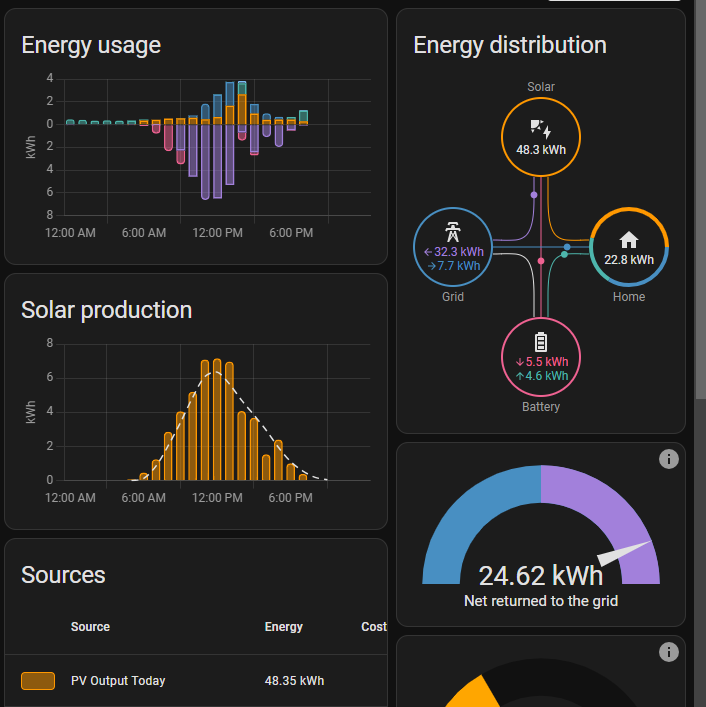
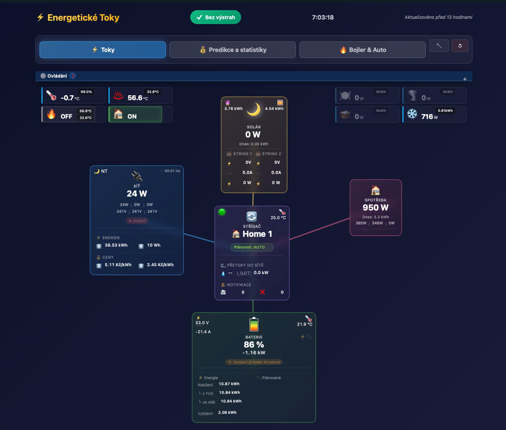
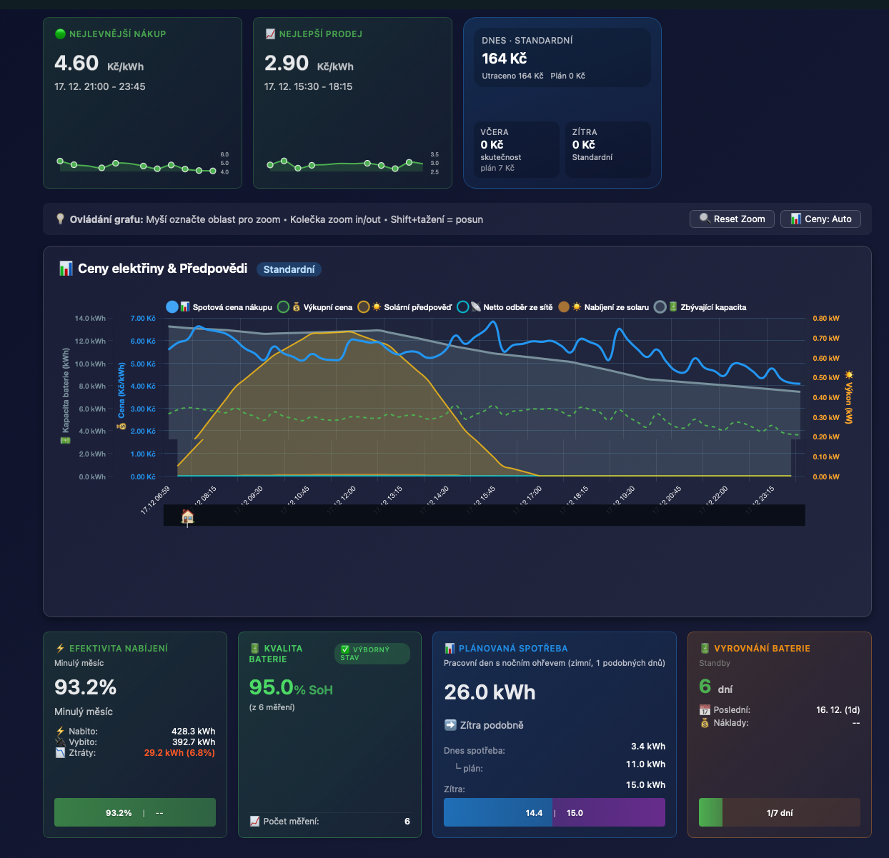
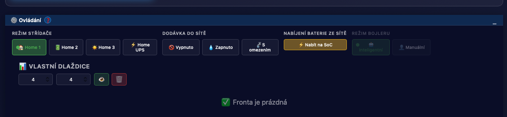
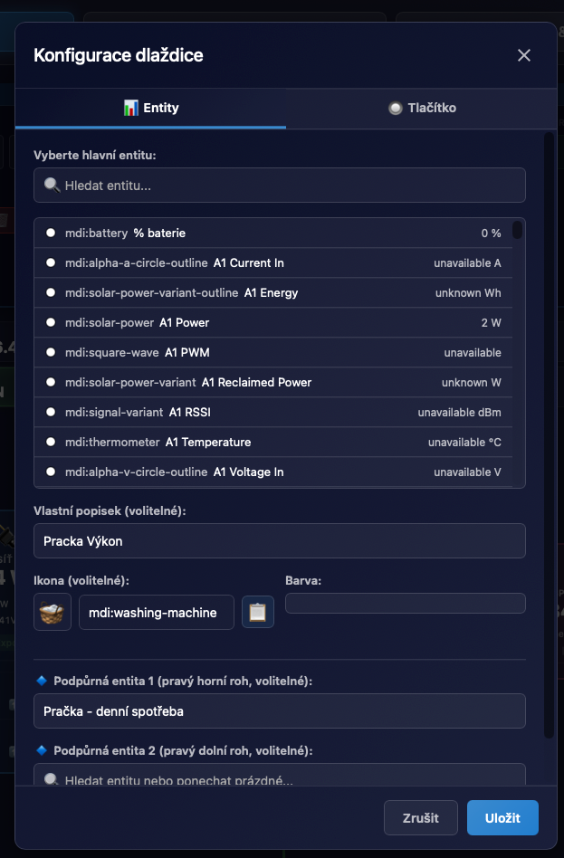

# OIG Dashboard - Průvodce

Kompletní průvodce webovým energetickým dashboardem pro monitorování a ovládání OIG Battery Box.



## 📋 Obsah

1. [Přehled](#přehled)
2. [Flow diagram](#flow-diagram)
3. [Ovládací panel](#ovládací-panel)
4. [ServiceShield fronta](#serviceshield-fronta)
5. [Plánovač a automatický režim](#plánovač-a-automatický-režim)
6. [Statistiky](#statistiky)
7. [Vlastní dlaždice](#vlastní-dlaždice)
8. [Mobilní zobrazení](#mobilní-zobrazení)
9. [Tipy a triky](#tipy-a-triky)

---

## 🎯 Přehled

OIG Dashboard je interaktivní webové rozhraní zobrazující:

- **Tok energie** v reálném čase (solár → baterie → dům → síť)
- **Ovládání režimů** (box mode, grid delivery, boiler)
- **ServiceShield frontu** s přehledem změn
- **Statistiky** a detailní informace o systému
- **ČHMÚ badge** s varováními a detailním dialogem (pokud je modul zapnutý)
- **Aktualizováno** čas poslední aktualizace dat

### Kde dashboard najdu?

📍 **Boční panel → OIG Dashboard**

### Jak dashboard zapnout?

Dashboard se aktivuje během konfigurace integrace. Pokud ho nemáte zapnutý:

1. **Nastavení** → **Zařízení a služby**
2. Najděte **OIG Cloud**
3. **⋮ (tři tečky)** → **Znovu nakonfigurovat**
4. Zaškrtněte **📊 Webový energetický dashboard**
5. Uložte a restartujte Home Assistant

### Ukázka: Toky (Flow)



---

## 🔄 Flow Diagram

Hlavní část dashboardu zobrazující tok energie mezi jednotlivými komponenty.

### Komponenty

```
     ☀️ SOLÁR                    🔋 BATERIE
    ┌─────────┐                 ┌─────────┐
    │ 3.2 kW  │────────────────>│  85 %   │
    │Dnes: 24 │                 │ 1.2 kW  │
    └─────────┘                 └─────────┘
         │                           │
         │                           │
         └──────────┬────────────────┘
                    │
                    ↓
              ┌─────────┐
              │ 🏠 DŮM  │
              │ 4.1 kW  │
              └─────────┘
                    │
                    ↓
              ┌─────────┐
              │ 🔌 SÍŤ  │
              │ 0.3 kW  │
              └─────────┘
```

### 1. ☀️ Solár (FVE)

**Hlavní hodnota:**

- Aktuální výkon FVE v W nebo kW
- Automatické přepínání jednotek (nad 1000 W → kW)

**Dnes:**

- Celková výroba za dnešek v kWh

**Detaily (rozbalit kliknutím):**

```
String 1:  1.6 kW  │  String 2:  1.6 kW
U: 380V  I: 4.2A   │  U: 380V  I: 4.2A
```

**Barvy:**

- 🟢 Zelená: Výroba probíhá (> 0 W)
- ⚪ Šedá: Žádná výroba (0 W, noc)

**Co znamenají hodnoty:**

- **Výkon (W/kW):** Kolik energie FVE právě vyrábí
- **Dnes (kWh):** Součet výroby od půlnoci
- **String 1/2:** Výkon z každého solárního stringu
- **U (napětí):** Napětí na stringu (V)
- **I (proud):** Proud tekoucí ze stringu (A)

**💡 Tip:** Kliknutím na hodnotu otevřete detail entity s historií.

---

### 2. 🔋 Baterie

**Hlavní hodnota:**

- Stav nabití (SOC) v %
- Vizuální indikátor naplnění

**Výkon:**

- Kladná hodnota = nabíjení (zelená)
- Záporná hodnota = vybíjení (oranžová)
- 0 W = idle (šedá)

**Detaily (rozbalit kliknutím):**

```
🔌 Proud:      12.5 A
⚡ Napětí:     48.2 V
🌡️ Teplota:    23 °C

📊 Dnes:
  ⬆️ Nabito:     15.2 kWh
     └─ Z FVE:    12.1 kWh
     └─ Ze sítě:   3.1 kWh
  ⬇️ Vybito:      8.5 kWh
```

**Barvy:**

- 🟢 Zelená: Nabíjení (kladný výkon)
- 🟠 Oranžová: Vybíjení (záporný výkon)
- ⚪ Šedá: Idle (0 W)

**Ikony:**

- ⚡ Blesk: Rychlé nabíjení/vybíjení (>1 kW)
- 🔋 Baterie: Normální provoz

**Co znamenají hodnoty:**

- **SOC (%):** State of Charge = stav nabití
- **Výkon (W/kW):** Rychlost nabíjení (+) nebo vybíjení (-)
- **Proud (A):** Elektrický proud do/z baterie
- **Napětí (V):** Napětí bateriového systému
- **Teplota (°C):** Teplota BMS (Battery Management System)

---

### 3. 🏠 Dům (Spotřeba)

**Hlavní hodnota:**

- Aktuální spotřeba domácnosti v W nebo kW

**Dnes:**

- Celková spotřeba za dnešek v kWh

**Fáze (rozbalit kliknutím):**

```
L1: 1.2 kW  │  L2: 1.5 kW  │  L3: 1.4 kW
```

**Barvy:**

- 🟡 Žlutá: Normální spotřeba
- 🔴 Červená: Vysoká spotřeba (> 5 kW)

**Co znamenají hodnoty:**

- **Výkon (W/kW):** Okamžitá spotřeba celého domu
- **Dnes (kWh):** Spotřeba od půlnoci
- **L1/L2/L3:** Spotřeba na jednotlivých fázích

**💡 Tip:** Vysoká spotřeba na jedné fázi může znamenat nesymetrii - zkuste spotřebiče přerozdělit.

---

### 4. 🔌 Síť

**Hlavní hodnota:**

- Kladná: Odběr ze sítě (kupujete)
- Záporná: Dodávka do sítě (prodáváte)

**Frekvence:**

- Frekvence sítě v Hz (normálně ~50 Hz)

**Detaily (rozbalit kliknutím):**

```
📊 Dnes:
  ⬇️ Odběr:       2.5 kWh
  ⬆️ Dodávka:     8.2 kWh

💰 Spot ceny (pokud zapnuto):
  Aktuální:     2.15 Kč/kWh
  Výkup:        1.50 Kč/kWh

📈 Fáze:
  L1: 0.1 kW  380V  │  L2: 0.1 kW  380V  │  L3: 0.1 kW  380V
```

**Barvy:**

- 🔵 Modrá: Odběr ze sítě (kladná hodnota)
- 🟢 Zelená: Dodávka do sítě (záporná hodnota)
- ⚪ Šedá: Žádný tok (0 W)

**Co znamenají hodnoty:**

- **Výkon (W/kW):** Tok energie ze/do sítě
- **Odběr (kWh):** Kolik jste odebrali ze sítě dnes
- **Dodávka (kWh):** Kolik jste dodali do sítě dnes
- **Spot cena:** Aktuální burzovní cena elektřiny
- **Výkupní cena:** Cena za dodávku do sítě

---

### 5. 🌡️ Boiler (volitelné, pouze stav)

Pokud máte připojený bojler, flow diagram zobrazuje aktuální stav (pouze pro čtení):

**Aktuální stav:**

- Aktuální výkon, energie za dnešek, teplota, stav ohřevu

**Detaily:**

```
⚡ Aktuální:   1.2 kW
📊 Dnes:       8.5 kWh
🌡️ Teplota:    55 °C
🔧 Stav:       Ohřev
```

> ℹ️ **Ovládání bojleru** (změna režimu, plánování ohřevu) je dostupné výhradně
> v **Dashboard V2**. V1 zobrazuje stav, ale žádné write operace nejsou dostupné.

---

## 🎛️ Ovládací Panel

Panel pro změnu režimů systému s potvrzením a ServiceShield ochranou.

### 1. 📦 Režim box

```
┌─────────────────────────────────────────┐
│ 📦 Režim Box                            │
│                                         │
│ [🏠 Home 1] [🏠 Home 2] [🏠 Home 3] [🔌 Home UPS]
└─────────────────────────────────────────┘
```

**Režimy:**

#### 🏠 Home 1 (doporučeno)

- **Popis:** Základní režim (maximalizace vlastní spotřeby)
- **Chování:**
  - Solár → dům, přebytek → baterie
  - Deficit → baterie (síť až když baterie nestačí)
- **Kdy použít:** Běžný provoz

#### 🏠 Home 2

- **Popis:** Šetří baterii (nevybíjí do zátěže)
- **Chování:**
  - Solár → dům, přebytek → baterie
  - Deficit → síť (baterie zůstává)
- **Kdy použít:** Chcete držet SOC

#### 🏠 Home 3

- **Popis:** Solar prioritně nabíjí baterii
- **Chování:**
  - Solár → baterie
  - Spotřeba domu primárně ze sítě
- **Kdy použít:** Chcete dobíjet baterii ze slunce

#### 🔌 Home UPS

- **Popis:** Nabíjení ze sítě (UPS)
- **Chování:**
  - Síť + solár → baterie
  - Spotřeba domu ze sítě
- **Kdy použít:** Plánované nabíjení ze sítě (levné okno)

**🛡️ Potvrzení:**
Po kliknutí na režim se zobrazí dialog:

```
Změnit režim na Home 1?

[ ] Rozumím, že změna může trvat několik minut

           [Zrušit]  [Potvrdit]
```

---

### 2. 🌊 Grid Delivery (Dodávka do sítě)

```
┌─────────────────────────────────────────┐
│ 🌊 Dodávka do sítě                      │
│                                         │
│ [💧 Zapnuto] [🚫 Vypnuto] [🔄 S omezením]
│                                         │
│ Limit: [5000] W     [Nastavit]         │
└─────────────────────────────────────────┘
```

**Režimy:**

#### 💧 Zapnuto

- Neomezená dodávka do sítě
- Veškerý přebytek jde do sítě
- Maximální výkup energie

#### 🚫 Vypnuto

- Žádná dodávka do sítě
- Přebytky jdou pouze do baterie
- Izolace od sítě

#### 🔄 S omezením

- Dodávka omezena na nastavený limit (W)
- Přebytky nad limit jdou do baterie
- Ochrana před přetížením domácího vedení

**💡 Tip:** Pokud máte fázový distribuční bod, nastavte limit podle max. dodávky na fázi.

---

### 3. 🌡️ Režim bojleru (V1 — Pouze pro čtení)

```
┌─────────────────────────────────────────┐
│ 🌡️ Režim bojleru                        │
│                                         │
│ 📖 Pouze pro čtení                      │
│ Ovládání: Dashboard V2                  │
└─────────────────────────────────────────┘
```

> ⚠️ **V1 záložka bojleru je pouze pro čtení.**
> Ovládání bojleru (plánování ohřevu, změna režimu CBB/Manuální, manuální override) je dostupné
> výhradně v **Dashboard V2**. V1 zobrazuje aktuální stav bojleru, ale zápis je zablokován.

**Zobrazuje:**

- Aktuální režim bojleru (informativně)
- Stav a historická data v záložce „Bojler & Auto"

**Pro ovládání bojleru použijte Dashboard V2.**

---

## 🛡️ ServiceShield Fronta

Přehled čekajících a běžících změn režimů.

```
┌─────────────────────────────────────────────────────────────┐
│ 📋 Fronta požadavků ▶ (klikněte pro rozbalení)             │
└─────────────────────────────────────────────────────────────┘
```

Po rozbalení:

```
┌─────────────────────────────────────────────────────────────┐
│ 📋 Fronta požadavků ▼                                       │
│                                                             │
│ ┌─────────────────────────────────────────────────────────┐│
│ │ 🏃 Běží:  Změna režimu Box                              ││
│ │ Služba:   set_box_mode                                  ││
│ │ Cíl:      Home 1 (aktuálně: Home UPS)                   ││
│ │ Čas:      15:32:45                                      ││
│ │ Trvání:   0:00:12                                       ││
│ └─────────────────────────────────────────────────────────┘│
│                                                             │
│ ⏳ Čekající (1):                                            │
│ ┌─────────────────────────────────────────────────────────┐│
│ │ Změna dodávky do sítě                                   ││
│ │ Cíl: S omezením (limit: 5000 W)                         ││
│ │ Vytvořeno: 15:32:50                                     ││
│ └─────────────────────────────────────────────────────────┘│
│                                                             │
│ ✅ Dokončené (poslední 3):                                  │
│ • Změna režimu bojleru → Inteligentní (15:30, 0:01:05)    │
│ • Změna režimu Box → Home 2 (15:15, 0:00:45)              │
│ • Změna dodávky → Vypnuto (15:00, 0:00:32)                │
└─────────────────────────────────────────────────────────────┘
```

**Stavy požadavků:**

- 🏃 **Běží:** Služba se právě provádí
- ⏳ **Čekající:** Ve frontě, čeká na provedení
- ✅ **Dokončeno:** Úspěšně provedeno
- ❌ **Chyba:** Služba selhala

**Co informace znamenají:**

- **Služba:** Název volané služby (`set_box_mode`, `set_grid_delivery`, atd.)
- **Cíl:** Požadovaná hodnota/režim
- **Aktuálně:** Současný stav (před změnou)
- **Čas:** Kdy byla služba zavolána
- **Trvání:** Jak dlouho služba běží

**💡 Tip:** Pokud služba běží déle než 5 minut, může být problém. Zkontrolujte logy.

---

## 🧠 Plánovač a automatický režim

Pokud máte zapnutý plánovač (Battery forecast), dashboard navíc zobrazuje:

- **timeline/plán** (kdy se očekává nabíjení ze sítě, kdy se šetří baterie na drahé hodiny apod.)
- **toggle „Automatický režim“** – zapnutí/vypnutí automatického přepínání režimů podle plánu
- **dialog timeline** s taby: včera / dnes / zítra / srovnání / detail / historie

Detailní popis chování, zapnutí/vypnutí a technické pozadí: `./PLANNER.md`.

---

## 📊 Statistiky

Dole v dashboardu najdete klíčové statistiky:

```
┌──────────────┬──────────────┬──────────────┬──────────────┐
│ ☀️ FVE Dnes  │ 🔋 SOC       │ 🏠 Spotřeba  │ 🔌 Tarif     │
│ 24.5 kWh     │ 85 %         │ 4.1 kW       │ VT           │
└──────────────┴──────────────┴──────────────┴──────────────┘
```

### Box info

```
┌──────────────────────────────────────────┐
│ 📦 Box Info                              │
│                                          │
│ 🔧 Režim:      Home 1                    │
│ 🌊 Grid:       S omezením (5000 W)      │
│ 🔥 Bypass:     ✅ Aktivní                │
│ 🌡️ Teplota:    35 °C                    │
│                                          │
│ 🔔 Notifikace: 2 nepřečtené (1 chyba)   │
└──────────────────────────────────────────┘
```

### Predikce a metriky (pokud máte zapnuto)

V sekci „Predikce a statistiky“ se typicky objevují:

- **Efektivita baterie** (`sensor.oig_XXXXX_battery_efficiency`)
- **Kvalita baterie / SoH** (`sensor.oig_XXXXX_battery_health`)
- **Profiling spotřeby (72h)** (`sensor.oig_XXXXX_adaptive_load_profiles`)
- **Balancování baterie** (`sensor.oig_XXXXX_battery_balancing`)

Co přesně tyto metriky znamenají a jak se počítají: `./STATISTICS.md`.



---

## 🧩 Vlastní dlaždice

Dashboard umí zobrazit „Vlastní dlaždice“ přímo ve flow diagramu (vlevo a vpravo).

Co umí:

- dlaždice mohou zobrazovat libovolné entity (stav + ikona + název),
- můžete přidat i „tlačítkové“ dlaždice (volání služby / přepnutí entity),
- konfigurace se ukládá do Home Assistant (aby se synchronizovala mezi prohlížeči) a zároveň do localStorage jako cache.

Jak je nastavit:

1. V ovládacím panelu otevřete sekci **📊 Vlastní dlaždice**.
2. Nastavte počet dlaždic vlevo/vpravo (0–4) a případně sekci skryjte/zobrazte.
3. Kliknutím na konkrétní dlaždici otevřete dialog a vyberte entitu / akci.

Technicky dashboard používá služby `oig_cloud.get_dashboard_tiles` a `oig_cloud.save_dashboard_tiles` (viz `./SERVICES.md`).





---

## 📱 Mobilní zobrazení

Dashboard je plně responzivní a přizpůsobený pro mobily:

### Vertikální layout

```
┌─────────────┐
│   ☀️ SOLÁR  │
│   3.2 kW    │
├─────────────┤
│      ↓      │
├─────────────┤
│  🔋 BATERIE │
│   85%, 1kW  │
├─────────────┤
│      ↓      │
├─────────────┤
│   🏠 DŮM    │
│   4.1 kW    │
├─────────────┤
│      ↓      │
├─────────────┤
│   🔌 SÍŤ    │
│   0.3 kW    │
└─────────────┘
```

### Touch-friendly tlačítka

- Větší tlačítka pro snadné ovládání
- Swipe gesta pro rozbalení sekcí
- Optimalizované pro telefony i tablety

---

## 💡 Tipy a Triky

### 1. Rychlé akce

**Kliknutím na hodnotu** otevřete detail entity:

- Historie výroby/spotřeby
- Grafy za den/týden/měsíc
- Možnost přidat do automatizace

### 2. Automatické obnovení

Dashboard se automaticky aktualizuje každých 5 sekund.
Není třeba ručně obnovovat stránku.

### 3. Notifikace

Dashboard může zobrazovat notifikace:

- ⚠️ Varování (nízká baterie, vysoká spotřeba)
- ❌ Chyby (selhání služby)
- ℹ️ Info (změna režimu dokončena)

### 4. Klávesové zkratky

- `R` - Refresh (ruční obnovení)
- `E` - Expand all (rozbalit všechny sekce)
- `C` - Collapse all (sbalit všechny sekce)
- `?` - Help (nápověda)

### 5. Customizace

Dashboard respektuje Home Assistant theme:

- 🌙 Tmavý režim
- ☀️ Světlý režim
- 🎨 Vlastní barvy z vašeho theme

Navíc můžete přizpůsobit i „Vlastní dlaždice“ (viz sekce `#vlastní-dlaždice`).

### 6. Sdílení

Dashboard má jedinečnou URL:

```
http://homeassistant.local:8123/oig-cloud-dashboard
```

Můžete ho sdílet s dalšími uživateli (vyžaduje přihlášení).

---

## ❓ Časté otázky

### Q: Dashboard nefunguje, co dělat?

**A:**

1. Zkontrolujte, že je dashboard zapnutý v konfiguraci
2. Restartujte Home Assistant
3. Vymažte cache prohlížeče (Ctrl+F5)
4. Zkontrolujte logy: Nastavení → Systém → Logy

### Q: Entity nemají hodnoty

**A:**
Počkejte 5-10 minut na první aktualizaci dat z API.

### Q: Tlačítka nereagují

**A:**

1. Zkontrolujte, že máte zapnutý ServiceShield
2. Podívejte se do fronty, zda služba neběží
3. Zkontrolujte, že máte platné přihlášení k OIG Cloud

### Q: Flow diagram se nezobrazuje správně

**A:**

1. Zkontrolujte velikost okna (min. 768px šířka)
2. Aktualizujte prohlížeč na nejnovější verzi
3. Zkuste jiný prohlížeč (Chrome, Firefox, Safari)

### Q: Mohu si dashboard přizpůsobit?

**A:**
Dashboard je plně customizovatelný přes HA themes.
Můžete změnit barvy, fonty, rozložení v theme konfiguraci.

### Q: Dashboard spotřebovává hodně dat?

**A:**
Ne, dashboard používá WebSocket pro aktualizace,
což je velmi efektivní (~ 1-2 KB/min).

---

## 🆘 Podpora

Pokud máte problémy s dashboardem:

- 📖 **Dokumentace:** [README.md](../../README.md)
- 🔧 **Troubleshooting:** [TROUBLESHOOTING.md](TROUBLESHOOTING.md)
- 💬 **Diskuse:** [GitHub Discussions](https://github.com/psimsa/oig_cloud/discussions)
- 🐛 **Hlášení chyb:** [GitHub Issues](https://github.com/psimsa/oig_cloud/issues)

---

**Užijte si monitoring a ovládání vašeho OIG Battery Box!** ⚡🔋
