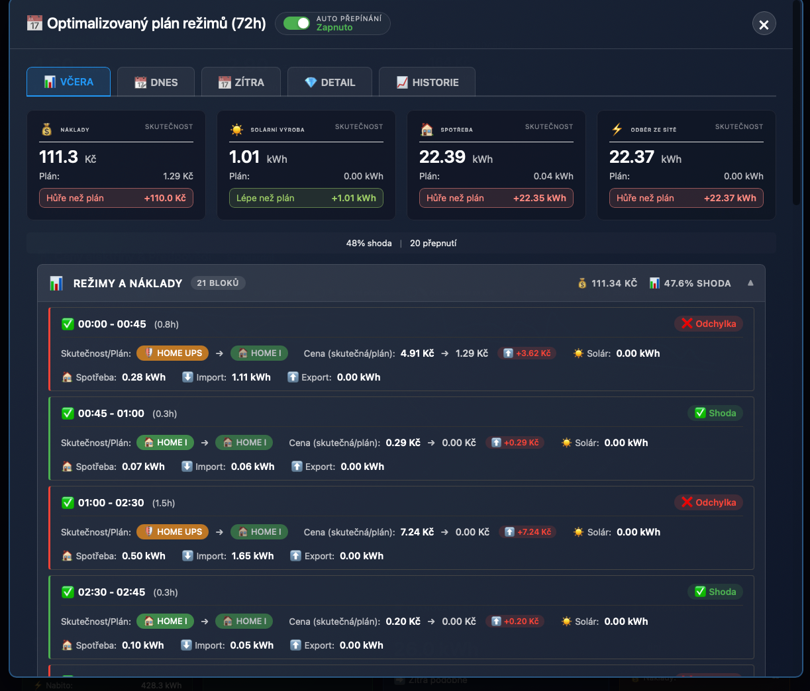

# Plánovač nabíjení (Battery forecast) a automatický režim

Plánovač v OIG Cloud integraci počítá:

- **predikci chování baterie** (vývoj kapacity/SOC v čase),
- **kdy a kolik nabíjet ze sítě** (HOME UPS / grid charging),
- **shrnutí pro dashboard** (timeline, detailní záložky „včera/dnes/zítra“).

Součástí je i volitelný **automatický režim**, který umí přepínat režimy Battery Boxu podle vypočteného plánu.

## Jak plánovač zapnout

1. `Nastavení → Zařízení a služby → OIG Cloud → Konfigurovat / Rekonfigurovat`
2. Zapněte **Plánovač nabíjení (Battery forecast)**.
3. Nastavte související parametry (min/target, cena, výkon nabíjení, strategie levných hodin…).

## Jak poznám, že plánovač běží

Typicky uvidíte tyto entity (příklady):

- `sensor.oig_XXXXX_battery_forecast` – hlavní predikce (state + rozsáhlé attributes s timeline)
- `binary_sensor.oig_XXXXX_grid_charging_planned` / `sensor.oig_XXXXX_grid_charging_planned` – indikace plánovaného nabíjení ze sítě + intervaly/cena v attributes

Dashboard z toho vykresluje časovou osu a dlaždice „Today plan / Grid charging“.

Podrobnosti k metrikám a statistikám: `./STATISTICS.md`.

## Ukázka: optimalizovaný plán režimů (72h)

## Automatický režim (auto mode)

Pokud zapnete **Automatické přepínání režimů podle plánu**:

- integrace bude automaticky volat `oig_cloud.set_box_mode` (přes ServiceShield, pokud je zapnutý),
- cílem je držet plánovaný režim v čase (např. nabíjet v levných oknech, šetřit baterii pro drahé hodiny),
- plán se průběžně přepočítává podle nových dat (spot ceny, výroba, spotřeba, SOC…).

### Zapnutí/vypnutí

Nejjednodušší je přes OIG Dashboard (toggle „Automatický režim“).

Technicky je to nastavení uložené v config entry a dashboard ho ovládá přes REST endpoint:

- `GET /api/oig_cloud/battery_forecast/<box_id>/planner_settings`
- `POST /api/oig_cloud/battery_forecast/<box_id>/planner_settings` s JSON:
  - `{ "auto_mode_switch_enabled": true }` nebo `{ "auto_mode_switch_enabled": false }`

## Co plánovač (ne)dělá

- Plánovač **nepřepisuje** vaše ruční volání služeb – pokud ručně přepnete režim, auto mode se může snažit vrátit systém do „plánovaného“ stavu až v dalším kroku plánu.
- Auto mode přepíná jen to, co umí přes služby integrace (primárně `set_box_mode`).

## Doporučení a bezpečnost

- Auto mode zapínejte až ve chvíli, kdy:
  - máte ověřené správné entity (spot ceny, výroba/spotřeba, SOC),
  - rozumíte dopadu režimů (hlavně HOME UPS / nabíjení ze sítě),
  - máte zapnutý ServiceShield (lepší kontrola, fronta, retry).
